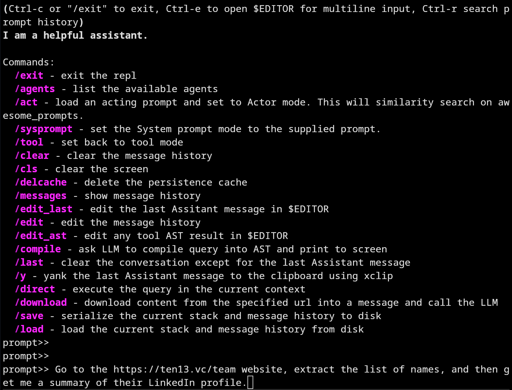
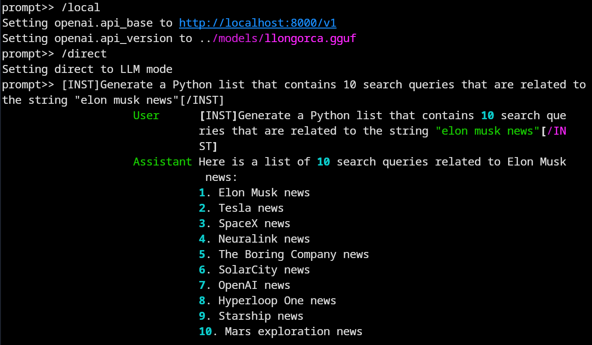

# LLMVM

This project is a research prototype that enables a Large Language Model (LLM) to break down user tasks into manageable sub-tasks, and then schedule and oversee their execution on an intepreted virtual machine, collaboratively addressing syntax and semantic errors through a back-and-forth dialogue.

## The Problem

ChatGPT supports 'function calling' by passing a query (e.g. "What's the weather in Boston") and a JSON blob with the signatures of supporting functions available to be called locally (i.e. def get_weather(location: str)...). Examples seen [here](https://medium.com/@lucgagan/understanding-chatgpt-functions-and-how-to-use-them-6643a7d3c01a).

However, this interaction is usually User Task -> LLM decides what helper function to call -> local host calls helper function -> work with result, and does not allow for arbitrary deconstruction of a task into a series of helper function calls that can be intermixed with both control flow, or cooperative sub-task execution.

This prototype shows that LLM's are capable of taking a user task, reasoning about how to deconstruct the task into sub-tasks, understanding how to program, schedule and execute those sub-tasks on its own or via a virtual machine, and working with the VM to resolve error cases. We ask the LLM to use [Starlark](https://github.com/bazelbuild/starlark) expressed as [A-normal form](https://en.wikipedia.org/wiki/A-normal_form) as the programming language, and execute Starlark statement-by-statement on a local Python interpreter. When errors arise (syntax errors, exceptions, or semantic problems), we pause execution and work with the LLM to understand and resolve the error by exposing the locals dictionary, and allowing the LLM to "debug" the current execution state.

## Example Walkthrough

We will walk through what happens when handing LLMVM the query: `"Go to the https://ten13.vc/team website, extract the list of names, and then get me a summary of their LinkedIn profiles."`



This is the Starlark code returned from ChatGPT 3.5 when passing the query + [prompt](https://github.com/9600dev/llmvm/blob/master/prompts/starlark/starlark_tool_execution.prompt) pair:

```python
var1 = download("https://ten13.vc/team")  # Step 1: Download the webpage
var2 = llm_call([var1], "extract list of names")  # Step 2: Extract the list of names from the webpage
answers = []  # Initialize an empty list to store the summaries
for list_item in llm_loop_bind(var2, "list of names"):  # Step 3: Loop over the list of names
    var3 = llm_bind(list_item, "WebHelpers.search_linkedin_profile(first_name, last_name company_name)")  # Step 4: Search and get the LinkedIn profile of each person
    var4 = llm_call([var3], "summarize career profile")  # Step 5: Summarize the career profile of each person
    answers.append(var4)  # Step 6: Add the summary to the list of answers
answer(answers)  # Step 7: Show the summaries of the LinkedIn profiles to the user

```

Execution of this code proceeds step-by-step until completion, or error. Let's walk through each line:

#### ```var1 = download("https://ten13.vc/team")```

The [download()](https://github.com/9600dev/llmvm/blob/01816aeb7107c5a747ee62ac3475b5037d3a83d7/starlark_runtime.py#L392C12-L392C12) function is part of a set of user definable base class libraries that the LLM knows about: download() llm_call() llm_loop_bind(), llm_bind(), answer() and so on. download() fires up an instance of Firefox via [Playwright](https://playwright.dev/) to download web or PDF content and convert them to Markdown.

#### ```var2 = llm_call([var1], "extract list of names")  # Step 2: Extract the list of names```

[llm_call(expression_list, instruction) -> str](https://github.com/9600dev/llmvm/blob/f0caa7268822ec517af4a8b9c3afff6b086008e8/starlark_runtime.py#L427) takes an expression list, packages those expressions up into a stack of LLM User messages, and passes them back to the LLM to perform the instruction. If the stack of Messages is too big to fit in the context window, [faiss](https://github.com/facebookresearch/faiss) is used to chunk and rank message content via the following pseudocode:

  * Chunk content via tiktoken, 256 token chunks.
  * Take the original query "Go to the https://ten13.vc/team website ..." and the instruction query "extract list of names" and vector search and rank on message content.
  * Take a random sample of chunks, ask the LLM to decide if **all** content is required to achieve success in the task.
    * If "YES", Map-Reduce the task over all Message chunks.
    * If "NO", fit top (n) chunks sized to context window and perform instruction.
  * Return instruction result.

The map-reduce is done per-message, allowing for multiple expressions to be chunked and ranked independently, which is useful for queries like "download document 1, and document 2 and compare and contrast".

#### ```for list_item in llm_loop_bind(var2, "list of names"):  # Step 3: Loop over the list of names```

[llm_loop_bind(expression, instruction) -> List](https://github.com/9600dev/llmvm/blob/f0caa7268822ec517af4a8b9c3afff6b086008e8/starlark_runtime.py#L444) takes an arbitrary expression, converts it to a string, then has an LLM translate that string into a Starlark list ["one", "two", "three", ...].

In this particular case, ```var2``` has the following string, the response from GPT:

> Based on the provided data, here is a list of names:
>
> 1. Steve Baxter
> 2. Stew Glynn
> 3. An Vo
> 4. Alexander Cohen
> 5. Margot McQueen
> 6. Sophie Robertson
> 7. Mel Harrison
> 8. Elise Cannell
> 9. Seamus Crawford
> 10. Alexander Barrat

And ```llm_loop_bind()``` takes this arbitrary text and converts it to: ["Steve Baxter", "Stew Glynn", "An Vo", "Alexander Cohen", "Margot McQueen", "Sophie Robertson", "Mel Harrison", "Elise Cannell", "Seamus Crawford", "Alexander Barrat"]

####```var3 = llm_bind(list_item, "WebHelpers.search_linkedin_profile(first_name, last_name, company_name)")```

[llm_bind(expression, function_definition_str) -> Callable](https://github.com/9600dev/llmvm/blob/01816aeb7107c5a747ee62ac3475b5037d3a83d7/bcl.py#L276) is one of the more interesting functions. It takes an expression and a string based function definition and tries to bind arbitrary data to the function arguments (turning the definition into a callsite). It performs these steps:

* For these scopes [expression, original query, dictionary of currently in scope locals()] ask the LLM to bind the arguments (in this case: first_name, last_name, company_name).
* If the LLM can't bind any of the arguments, specify "None", then add a comment string "#" to the end of the callsite with a natural language question that, if answered, would allow the callsite to be bound. e.g:
  * WebHelpers.search_linkedin_profile("Steve", "Baxter", None)  # Which company does Steve Baxter work for?
* Move up a scope, and include the original binding ask, plus the LLM generated question, which combined greatly improves the odds of argument binding.
  * (in this particular case, the company Steve Baxter works for is defined in the original webpage download() string, and when the LLM is passed the locals() dictionary, is able to self-answer the question of "which company Steve Baxter works for" and thus bind the callsite properly).
  * -> WebHelpers.search_linkedin_profile("Steve", "Baxter", "Transition Level Investments")

#### ```answer(answers)  # Step 7: Show the summaries of the LinkedIn profiles to the user```

[answer()](https://github.com/9600dev/llmvm/blob/f0caa7268822ec517af4a8b9c3afff6b086008e8/starlark_runtime.py#L477) is a collection of possible answers that either partially solve, or fully solve for the original query. Once code is finished executing, each answer found in answers() is handed to the LLM for guidance on how effective it is at solving/answering the query. The result is then shown to the user, and in this case, it's a career summary of each of the individuals from [TEN13](https://ten13.vc) extracted from LinkedIn.

## Error Correction

Each step of statement execution is carefully evaluated. Calls to user defined helper functions may throw exceptions, and code may be semantically incorrect (i.e. bindings may be incorrect, leading to the wrong data being returned etc). LLMVM has the ability to back-track up the statement execution list (todo: transactional rollback of variable assignment is probably the right call here but hasn't been implemented yet) and work with the LLM to re-write code, either partially or fully, to try and achieve the desired outcome.

The code that performs error correction starts [here](https://github.com/9600dev/llmvm/blob/01816aeb7107c5a747ee62ac3475b5037d3a83d7/starlark_runtime.py#L219), but there's still a bit more work to do here, including having the LLM engage in a "pdb" style debugging session, where locals in the Python runtime can be inspected for code-rewriting decisions.

## Helpers

You can define any arbitrary helper, and add it to the Starlark Runtime in ```StarlarkRuntime.setup()```. It'll automatically generate the helper tool's one-shot prompt example for the LLM, and will appear in the LLM responses for Starlark generated code. The LLMVM runtime will sort out the binding and marshalling of arguments via llm_bind().

Here are the list of helpers written so far:

```python
WebHelpers.search_linkedin_profile(first_name, last_name, company_name)  # Searches for the LinkedIn profile of a given person name and optional company name and returns the profile text
WebHelpers.get_linkedin_profile(linkedin_url)  # Extracts the career information from a person's LinkedIn profile from a given LinkedIn url
EdgarHelpers.get_latest_form_text(symbol, form_type)  # This is useful to get the latest financial information for a company,
their current strategy, investments and risks.
PdfHelpers.parse_pdf(url_or_file)  # You can only use either a url or a path to a pdf file.
MarketHelpers.get_stock_price(symbol)  # Get the current or latest price of the specified stock symbol
MarketHelpers.get_market_capitalization(symbol)  # Get the current market capitalization of the specified stock symbol
EmailHelpers.send_email(sender_email, receiver_email, subject, body)  # Send an email from sender to receiver with the specified subject and body text
EmailHelpers.send_calendar_invite(from_name, from_email, attendee_emails, subject, body, start_date, end_date)  # Send a calendar invite to the attendee
```

Downloading web content (html, PDF's etc), and searching the web is done through special functions: ```download()``` and ```search()``` which are defined in the LLMVM runtimes base class libraries. ```download()``` as mentioned uses Firefox via Microsoft Playwright so that we can avoid web server blocking issues that tend to occur with requests.get(). ```search()``` uses [SerpAPI](https://serpapi.com/), which may require a paid subscription.

## Install

* Install pyenv: ```curl https://pyenv.run | bash```
  * ```pyenv install 3.11.4```
  * ```pyenv virtualenv 3.11.4 llmvm```
  * ```pyenv local llmvm```
* Install poetry: ```curl -sSL https://install.python-poetry.org | python3 -```
  * ```poetry config virtualenvs.prefer-active-python true```
  * ```poetry install```
* Edit config.yaml
  * cp config_example.yaml config.yaml
  * vim config.yaml
* Build and install FAISS
  * ```git submodule update --init --recursive```
  * ```cd faiss```
  * ```cmake -DFAISS_ENABLE_GPU=ON -DCUDAToolkit_INCLUDE_DIR=/usr/include -DCUDAToolkit_ROOT=/usr/lib/cuda -DCMAKE_CXX_STANDARD=11 -DCMAKE_CXX_STANDARD_REQUIRED=ON -B build .```
  * ```cd build```
  * ```make -C faiss -j faiss```
  * ```make -C faiss -j swigfaiss```
  * ```cd python```
  * ```python setup.py install```
* Run the llmvm repl:
  * ```python repl.py```
  * ```/help```

Ensure you have the following environment variables set:

```python
OPENAPI_API_KEY  # your openai API key
SERPAPI_API_KEY  # https://serpapi.com/ API key for web and news searches.
SEC_API_KEY  # if you want to use SEC's Edgar api to get 10K's and 10Q's etc, get an account at https://sec-api.io/
EDITOR  # set this to your favorite terminal editor (vim or emacs or whatever) so you can /edit messages or /edit_ast the Starlark code before it gets executed etc.
```

## Things to do

* Error handling still needs a lot of work.
* ChatGPT doesn't conform to system prompts specifying how to shape the output of the response. Saying things like "Only reply with Starlark code" and "don't apologize" tends to work randomly, or not at all. Need to fix this.
* Integration with local LLM's via [llama.cpp](https://github.com/ggerganov/llama.cpp) etc. [started]
* More complicated natural language queries tends to make the LLM generate unwieldy code. Need statement by statement execution, passing the LLM the already executed code, asking it if it wishes to re-write the later part of the code (sort of like continuation passing style execution).
* Playwright integration with LLM -- it should be straight forward to have cooperative execution for the task of proceeding through web app flows (login, do stuff, extract info, logout).
* Fix bugs and refactor. The code is pretty hacky.
* Write some docs.
* Integrate better usage of config.yaml.

## Using a Local LLM

I haven't had a lot of success getting LLama-2 chat trained models to respond well to this experiment, but you can give it a go:

* ```git submodule update --init --recursive```
* ```cd llama-cpp-python```
* ```CMAKE_ARGS="-DLLAMA_CUBLAS=on -DCUDAToolkit_INCLUDE_DIR=/usr/include -DCUDAToolkit_ROOT=/usr/lib/cuda" FORCE_CMAKE=1 VERBOSE=1 pip install .[server] -v --force-reinstall```
* ~~Download vicuna-13b-v1.5-16k (needed for the 16k context window): [https://huggingface.co/TheBloke/vicuna-13B-v1.5-16K-GGML](https://huggingface.co/TheBloke/vicuna-13B-v1.5-16K-GGML)~~
* Download LlongOrca-13B-16k (it at least works on some of the prompts) [here](https://huggingface.co/TheBloke/LlongOrca-13B-16K-GGML).
  * The latest version of llama.cpp has moved to the [gguf file format](https://github.com/ggerganov/ggml/issues/220), so we need to convert the GGML file to .gguf for now:
  * ```./convert-llama-ggmlv2-to-gguf.py --input llongorca-13b-16k.ggmlv3.q4_1.bin --output llongorca.gguf```
* ```python -m llama_cpp.server --n_gpu_layers 41 --model ../models/llongorca.gguf --n_ctx 16384 --rope_freq_base 10000 --rope_freq_scale 0.25 --n_threads 10 --verbose True```
  * This should fire up an OpenAI API compatible web server that we can use with LLMVM
* ```python repl.py```
* ```/local```
* ```/direct What is your name? ```
  * Assistant: My name is AI Assistant.


### Notes on LLaMA2 testing

I spent a day trying to wire up LLMVM to Llama 2 and a host of fine-tuned derivatives on my RTX 4090. At this point, it doesn't work, and I'm surprised that the local llm community can say hand-on-heart that it's close to, or beats GPT 3.5.

The biggest issue is that Llama 2 and its instruction tuned variants don't follow direction:



The example above fails to generate a parsable Python string expression. This is the same for CodeLlama Instruct, LLongOrca, Vicuna and so on.

The prompt "Generate a Python list that has 10 example strings." gives strange results too:

> "Here is an example of a Python list containing 10 example strings:
>
> example_strings = ["hello", "world", "python", "list", "of", "examples"]
>
> This list contains six strings: "hello", "world", "python", "list", "of", and "examples". You can modify this list by adding more items separated by commas within the square brackets [].

llama-2-70b-chat can do it eventually, if you coerce it using a very specific prompt:

> You are a search query generator that generates alternative queries to run in a search engine. Generate a Python List declaration with 5 search queries related to "elon musk news".

Result:

```python
elon_musk_queries = ['Elon Musk latest news', 'Elon Musk SpaceX updates', 'Tesla news Elon Musk', 'Elon Musk Twitter updates', 'Elon Musk interview recent']
```

The same prompt in Code Llama instruct fails. As does LlongOrca.

Maybe 70B has some promise, but I can't run it on my local RTX 4090. A 4-bit quantized 70B would require 2x 4090 GPU's. Bang-for-buck, GPT 3.5 kills it.


# More LLMVM Examples

```python
prompt>> Get me the latest 10-Q for NVDA and summarize the financial results.
```
...

> Financial Results for NVDA Stock:
>
> - Revenue: In the first quarter of fiscal year 2024, NVDA reported a total revenue of $7.19 billion, representing a 13% decrease compared to the same quarter in the previous fiscal year. This decline in revenue was
> primarily driven by lower revenue from the Graphics segment, partially offset by higher revenue from the Compute & Networking segment.
>
> - Gross Margin: The gross margin for the first quarter of fiscal year 2024 was 64.6%, slightly lower than the gross margin of 65.6% in the first quarter of fiscal year 2023. This decrease in gross margin was primarily
> due to a shift in product mix.
>
> - Operating Income: NVDA's operating income for the first quarter of fiscal year 2024 was $2.14 billion, reflecting a 14% increase compared to the first quarter of fiscal year 2023. This increase in operating income
> was primarily driven by lower operating expenses.
>
> - Net Income: The net income for the first quarter of fiscal year 2024 was $2.04 billion, representing a 26% increase compared to the first quarter of fiscal year 2023. This increase in net income was primarily due to
> higher operating income and lower income tax expense.
>
> Segment Results:
>
> 1. Compute & Networking Segment: The revenue from the Compute & Networking segment in the first quarter of fiscal year 2024 was $4.46 billion, indicating a 22% increase compared to the first quarter of fiscal year
> 2023. This growth in revenue was primarily driven by higher revenue from the Data Center accelerated computing platform and networking solutions.
>
> 2. Graphics Segment: The revenue from the Graphics segment in the first quarter of fiscal year 2024 was $2.73 billion, reflecting a 41% decrease compared to the first quarter of fiscal year 2023. This decline in
> revenue was primarily due to lower revenue from the GeForce GPUs for gaming.
>
> 3. All Other Category: The All Other category had an operating loss of $1.07 billion in the first quarter of fiscal year 2024, compared to an operating loss of $2.21 billion in the first quarter of fiscal year 2023.
> This decrease in operating loss was primarily due to lower operating expenses.
>
> Liquidity and Capital Resources:
>
> - As of April 30, 2023, NVDA had cash, cash equivalents, and marketable securities totaling $15.07 billion.
>
> - During the first quarter of fiscal year 2024, NVDA paid $99 million in cash dividends to its shareholders.
>
> - NVDA has a share repurchase program, and as of April 30, 2023, the company was authorized to repurchase an additional $7.23 billion of shares through December 2023.
>
> - NVDA believes that its existing cash, cash equivalents, and marketable securities, along with cash generated from operations, will be sufficient to meet its anticipated cash needs for at least the next 12 months.
>
> Key Business Developments:
>
> - During the first quarter of fiscal year 2024, NVDA made several key business developments, including the announcement of the NVIDIA Grace CPU designed for giant-scale AI and high-performance computing, the expansion
> of the partnership with Mercedes-Benz for developing an in-vehicle computing system and AI infrastructure for autonomous driving, the introduction of the NVIDIA Omniverse Enterprise software platform for building and
> operating metaverse and 3D internet applications, and the launch of the NVIDIA CMP 170HX, a cryptocurrency mining processor.
>
> Outlook:
>
> Looking ahead, NVDA expects continued growth in its Data Center business driven by demand for AI, high-performance computing, and networking solutions. The company also anticipates a recovery in its Gaming business as
> supply constraints ease. Additionally, NVDA is excited about the opportunities in autonomous vehicles, robotics, and the metaverse. The company will continue to invest in research and development to drive innovation
> and expand its addressable market.
>
> Please note that this summary is based solely on the provided information and does not include any additional analysis or interpretation.
>
>

---
...


# Deprecated

**The text below was the readme for the first instantiation of this project.**

A prototype to demonstrate a natural language -> Abstract Syntax Tree -> Stack based Virtual Machine execution, where ChatGPT/Llama2 is cooperatively running VM instructions and helping plan execution flow.

# Install

* Install pyenv: ```curl https://pyenv.run | bash```
* ```pyenv install 3.11.4```
* ```pyenv virtualenv 3.11.4 llmvm```
* Install poetry: ```curl -sSL https://install.python-poetry.org | python3 -```
* ```poetry config virtualenvs.prefer-active-python true```
* ```poetry install```
* Build and install FAISS
  * ```git submodule update --init --recursive```
  * ```cd faiss```
  * ```cmake -DFAISS_ENABLE_GPU=ON -DCUDAToolkit_INCLUDE_DIR=/usr/include -DCUDAToolkit_ROOT=/usr/lib/cuda -DCMAKE_CXX_STANDARD=11 -DCMAKE_CXX_STANDARD_REQUIRED=ON -B build .```
  * ```make -C faiss -j faiss```
  * ```make -C faiss -j swigfaiss```
  * ```cd build/faiss/python```
  * ```python setup.py install```
* Run the llmvm repl:
  * ```python repl.py```
  * ```/help```

## The Problem

ChatGPT supports 'function calling' by passing a query (e.g. "What's the weather in Boston") and a JSON blob with the signatures of supporting functions available to be called locally (i.e. def get_weather(location: str)...). Examples seen [here](https://medium.com/@lucgagan/understanding-chatgpt-functions-and-how-to-use-them-6643a7d3c01a).

However, this interation is usually Task -> LLM decides what helper function to call -> Call helper function -> Work with result. And does not allow for arbitrary deconstruction of a task into a series of helper function calls that can be intermixed with both control flow, or cooperative sub-task execution.

This prototype shows that LLM's are capable of taking a user task, reasoning about how to deconstruct the task into sub-tasks, understanding how to schedule and execute those sub-tasks on its own or with via a virtual machine, and working with the VM to resolve error cases.

The LLM is able to build a mental-model of the Stack Based Virtual Machine through a natural language definition alone; emit an AST that runs on that VM through an [EBNF](https://tomassetti.me/ebnf/) grammar definition and many-shot examples; and then work with the VM to progress through sub-task execution through User Message -> Assistant Message -> User Message Chat interactions.

## Examples:

Input:
> "I'll give you a list of names and companies. I want you to summarize their careers and contact details: Bill Jia - Meta, Aparna Ramani - Facebook, Jeff Dean - Google."

Transformation to AST:

```
function_call(WebHelpers.search_linkedin_profile("Bill", "Jia", "Meta"))
llm_call("Summarize career profile and contact details")
answer(stack_pop(1))
function_call(WebHelpers.search_linkedin_profile("Aparna", "Ramani", "Facebook"))
llm_call("Summarize career profile and contact details")
answer(stack_pop(1))
function_call(WebHelpers.search_linkedin_profile("Jeff", "Dean", "Google"))
llm_call("Summarize career profile and contact details")
answer(stack_pop(1))
```

Input:

> "Explain the differences between these two papers that talk about BERT: https://arxiv.org/pdf/2004.09984.pdf and https://arxiv.org/pdf/1903.10676.pdf"

Transformation to AST:

```
function_call(PdfHelpers.parse_pdf("https://arxiv.org/pdf/2004.09984.pdf"))
set("var1", "Paper 1: https://arxiv.org/pdf/2004.09984.pdf")
function_call(PdfHelpers.parse_pdf("https://arxiv.org/pdf/1903.10676.pdf"))
set("var2", "Paper 2: https://arxiv.org/pdf/1903.10676.pdf")
get("var1")
llm_call(stack_pop(1), "Extract and summarize facts and opinions in the content.")
set("var3", "Summary of Paper 1: https://arxiv.org/pdf/2004.09984.pdf")
get("var2")
llm_call(stack_pop(1), "Extract and summarize facts and opinions in the content.")
set("var4", "Summary of Paper 2: https://arxiv.org/pdf/1903.10676.pdf")
get("var3")
get("var4")
llm_call(stack(), "Find and summarize differences in opinions between the two papers that are supplied in previous messages.")
answer(stack_pop(1))
```

The example above requires that each PDF be "map reduced" over "Extract and summarize facts and opinions in the content." because each PDF is too big to fit in a 16k context window.

The reduce phase generates a summary of each paper, which are both then loaded into the final llm_call context window to "find and summarize differences in opinions between the two papers...".

There is one other strategy (common in other implementations of LLM agent/chains/thought reasoning) used to fit content into the context window: chunking of the document into ~512 token chunks, then using the prompt to select and rank these chunks using a vector search database. We use faiss in this case.

More details on this at the end.


## EBNF Grammar

```
<program> ::= { <statement> }
<statement> ::= <llm_call> | <foreach> | <function_call> | <data> | <answer> | <set> | <get> | <uncertain_or_error>
<llm_call> ::= 'llm_call' '(' [ <stack> ',' <text> | <stack_pop> ',' <text> | <text> ] ')'
<foreach> ::= 'foreach' '(' [ <stack> | <stack_pop> | <data> ] ',' <statement> ')'
<function_call> ::= 'function_call' '(' <helper_function> ')'
<data> ::= 'data' '(' [ <list> | <stack> | <stack_pop> | <text> ] ')'
<answer> ::= 'answer' '(' [ <stack> | <stack_pop> | <text> ] ')'
<get> ::= 'get' '(' <text> ')'
<set> ::= 'set' '(' <text> ')'
<text> ::= '"' { <any_character> } '"'
<list> ::= '[' { <text> ',' } <text> ']'
<stack> ::= 'stack' '(' ')'
<stack_pop> ::= 'stack_pop' '(' <digit> ')'
<digit> ::= '0'..'9'
<any_character> ::= <all_printable_characters_except_double_quotes>
<helper_function> ::= <function_call_from_available_helper_functions>
```

Explanation of nodes:

```llm_call```: A call back to you, the Large Language Model (LLM) that reads the argument, tries to evaluate it, and pushes the response from the LLM on the top of the stack. Emit this node when you feel like you can contribute to the interpretation and execution of the argument supplied.

```foreach```: For each list item defined in the dataframe node, or a list that exists on the stack, or the entire stack as a list, execute the statement and push each of the results of statement execution on to the stack.

```function_call```: A function call you would like the virtual machine to execute for you. The function_call can only specify a function that is listed in "List of Functions:" below. There are no other functions the virtual machine can call. The result of the function call is pushed on top of the stack.

```answer```a direct answer or result from you that does not need further evaluation. answer nodes will be shown to the user, should be relevant to the users problem or question. answer nodes are not pushed on the stack. You can also use an answer node to pop all elements off the stack and into an answer node that will be shown to the user in response to their question or problem. To do this, use answer(stack()). You can also pop the top of the stack into an answer node using answer(stack()).

```dataframe```: use this to specify a list e.g. ["1", "2", "3"] or ["hello", "world"] or use dataframe(stack()) to coerce the all elements on the stack into a dataframe.

```stack```: represents all the elements or data on the execution stack. This node will pop all elements off the stack.

```stack_pop```: this node will pop off 'n' elements from the stack. Typically, you only need to pop 1 element off, using stack_pop(1). You can pop more elements off the stack, eg. 2 elements: stack_pop(2).

```set```: this node pops one element from the stack and copies the element into the supplied variable name. Eg. set("var1") will pop the top of the stack and copy the element to "var1". It does not push anything on the stack. Use this node for storage of results for use at a later part of AST execution.

```get```: this node retrieves the element in the supplied variable name and pushes it on to the stack. i.e. get("var1") will get the node in "var1" and push it on the stack.

## List of available helper functions:

Any function can be a helper function, so long as the argument types are simple types, and the output type is a string.

```
WebHelpers.get_url(url, force_firefox)  # Url can be a http or https web url or a filename and directory location.
WebHelpers.get_news_article(url)  # Extracts the text from a news article
WebHelpers.get_url_firefox(url)  # This is useful for hard to extract text, an exception thrown by the other functions,
or when searching/extracting from sites that require logins liked LinkedIn, Facebook, Gmail etc.
WebHelpers.search_news(query, total_links_to_return)  # Searches the current and historical news for a query and returns the text of the top results
WebHelpers.search_internet(query, total_links_to_return)  # Searches the internet for a query and returns the text of the top results
WebHelpers.search_linkedin_profile(first_name, last_name, company_name)  # Searches for the LinkedIn profile of a given person name and optional company name and returns the profile text
WebHelpers.get_linkedin_profile(linkedin_url)  # Extracts the career information from a person's LinkedIn profile from a given LinkedIn url
EdgarHelpers.get_latest_form_text(symbol, form_type)  # This is useful to get the latest financial information for a company,
their current strategy, investments and risks.
PdfHelpers.parse_pdf(url_or_file)  # You can only use either a url or a path to a pdf file.
MarketHelpers.get_stock_price(symbol)  # Get the current or latest price of the specified stock symbol
MarketHelpers.get_market_capitalization(symbol)  # Get the current market capitalization of the specified stock symbol
EmailHelpers.send_email(sender_email, receiver_email, subject, body)  # Send an email from sender to receiver with the specified subject and body text
EmailHelpers.send_calendar_invite(from_name, from_email, attendee_emails, subject, body, start_date, end_date)  # Send a calendar invite to the attendee
```

## How the interpreter handles input larger than context window:

Given:

```
function_call(WebHelpers.get_url("https://attract.ai/about-us/"))
llm_call(stack_pop(0), "From the content provided, Extract a list of all people names and the company name they work at")
```

where the HTML returned from https://attract.ai/about-us/ is larger than the context window, the interpreter will:

* Split the content into 512 token chunks based on sentence chunking.
* Randomly select 20% of the chunks, and ask the LLM to evaluate if the **all** chunks contain data relevant to the query task, in this case "extract a list of all people names ...".
* If true:
  * Run the LLM query in map reduce style, mapping all chunks to query, and reducing through summation. (slow and expensive)
* If false:
  * Chunk and perform FAISS based similarity, select top(n) chunks and perform query. (fast and cheap)

## Extra thoughts:

* Programs (or AST's) are arbitrarily composable. Executed programs can be serialized and later deserialized and pushed on the runtime stack as input to other programs.
* Error handling isn't implemented yet. Basic approach: if error occurs in AST node interpretation, either:
  * retry
  * propagate error up and allow parent node to handle
  * add extra context to interpretation (current stack is used for most context, but previous results from prior execution could be used.)
  * ask LLM to re-write AST from parent to try and improve probability of successful execution.

## TODO:

* We should tag the content that's been "map/reduced" so that it doesn't end up in future messatges.
* Check the result of openai chat response to see if we maxed out the tokens or not.