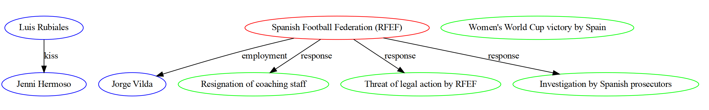

# LLMVM

LLMVM is a CLI based productivity tool that uses Large Language Models and local Python tools/helpers to reason about and execute your tasks. A CLI client (client.py) either connects directly to an LLM provider or will connect to a local server (server.py) that coordinates tool execution, [Retrieval Agumented Generation](https://blogs.nvidia.com/blog/what-is-retrieval-augmented-generation/), document search and more.

It does not use traditional tool calling API's, instead, it allows the LLM to interleave natural language and code, generally resulting in significantly better task deconstruction and execution. This is a [similar approach](https://towardsdev.com/codeact-the-engine-behind-manus-how-llms-are-learning-to-code-their-way-to-action-17c6c0fe1068) that [Manus](https://manus.im) uses, although LLMVM has been doing this since before it was cool.

LLMVM supports [Anthropic's](https://www.anthropic.com) Claude 4 (Opus Sonnet), Claude 3 (Opus, Sonnet and Haiku) models, and [OpenAI](https://openai.com/blog/openai-api) GPT 4o/4.1/o3/o4 models from OpenAI. [Gemini](https://deepmind.google/technologies/gemini/), [DeepSeek v3](https://www.deepseek.com/) and [Amazon Nova](https://docs.aws.amazon.com/nova/) are currently experimental. LLMVM is best used with either the [kitty](https://github.com/kovidgoyal/kitty) or [WezTerm](https://wezfurlong.org/wezterm/index.html) terminals as LLMVM will screenshot and render images as vision based tasks progress.


> **Update June 7th 2025**: Added the ability to "compile" a user/assistant message thread into a genericized and parameterized program. It will try and lift out repeated LLM calls by specializing code based on the "shape" of data it sees at runtime, and guard against that shape, bailing out to recompile if different shapes are seen. Basically a LLM JIT compiler... Try it, using "compile"

> **Update May 26th 2025**: Claude 4 models work out of the box, no changes. Made auto-rendering of Markdown for streaming tokens the default. Turn on and off via client_markdown_inline in config.yaml.

> **Update April 19th 2025**: Got o3 o4mini and gpt4.1 working. All reasoning models work now. -z "low" "medium" "high" for OpenAI, or -z num_of_tokens for Anthropic.

> **Update March 4th 2025**: Added Anthropic "thinking tokens" support. Use -z num_of_thinking_tokens to set the number of thinking tokens. Lots of bug fixes; browser works far better now. o3-mini works better - it does not like CoT examples, so the megaprompt has been split into reasoning and non-reasoning megaprompts.

> **Update Jan 3rd 2025**: DeepSeek v3 and Nova added, o1-preview and o1-mini have severely regressed. DeepSeek works quite well, Nova maybe slightly behind Gemini 1.5. o1-preview and o1-mini simply refuse to emit tokens with the code helpers [mega prompt](https://github.com/9600dev/llmvm/blob/master/llmvm/server/prompts/python/python_continuation_execution.prompt), and I haven't had time to figure out why.

> **Update October 8th 2024**: Gemini. Simply refuses to emit `<code></code>` tags so we've had to switch to `<helpers></helpers>` and `</helpers_result>`. Had to update the tools prompt to really really force gemini to not go out of bounds.

> **Update October 5th 2024**: Added full Browser API to helpers - LLM can click, type and navigate the browser; refactored the agentic/helper/tool code so you can build class/instance based tools that keep state between requests (see [browser.py](https://github.com/9600dev/llmvm/blob/master/llmvm/server/tools/browser.py) as an example).

> **Update September 21st 2024**: Added GPT o1-preview and o1-mini support, but it's not great. o1 seems to struggle to follow current prompt instructions, and really doesn't want to emit the 'code' blocks.

> **Update July 3rd 2024**: I've refactored most of how LLMVM works to use "continuation passing style" execution, where queries result in query -> natural language interleaved with code -> result, rather than the old query -> code -> natural language -> result. This results in significantly better task performance, so will be the default from here.

LLMVM's features are best explored through use case examples. Let's install, then go through some:

```
$ pip install llmvm-cli
```

```
$ playwright install
```

```
$ python -m llmvm.server

Default executor is: anthropic
Default model is: claude-sonnet-4-20250514
Default port is: 8011 $LLMVM_SERVER_PORT or config to change.

Make sure to `playwright install`.
If you have pip upgraded, delete ~/.config/llmvm/config.yaml to get latest config and helpers.
Loaded helper: search_linkedin_profile
Loaded helper: get_linkedin_profile
Loaded helper: get_hackernews_latest
Loaded helper: get_filings
Loaded helper: get_form_filing_or_item_url_as_markdown
Loaded helper: get_latest_filing_as_markdown
Loaded helper: get_stock_price
Loaded helper: get_current_market_capitalization
Loaded helper: get_stock_volatility
Loaded helper: get_stock_price_history
Loaded helper: get_stock_analysis
Loaded helper: get_options_chain
Loaded helper: datetime
Loaded helper: sample_normal
Loaded helper: sample_binomial
Loaded helper: sample_lognormal
Loaded helper: sample_list
Loaded helper: generate_graph_image
Loaded helper: matplotlib_to_image
Loaded helper: get_source_code_structure_summary
Loaded helper: get_source_code
Loaded helper: find_all_references_to_method
Loaded helper: get_weather
Loaded helper: address_lat_lon
Loaded helper: get_currency_rates
Loaded helper: get_gold_silver_price_in_usd
Loaded helper: get_bitcoin_prices_in_usd
Loaded helper: get_central_bank_rates
Loaded helper: get_tvshow_ratings_and_details
Loaded helper: search_and_replace
Loaded helper: find
Loaded helper: click_selector
Loaded helper: close
Loaded helper: find_and_click_on_expression
Loaded helper: find_selector_or_mouse_x_y
Loaded helper: goto
Loaded helper: mouse_move_x_y_and_click
Loaded helper: type_into_selector_or_mouse_x_y
Loaded helper: append_row
Loaded helper: append_rows
Loaded helper: batch_update
Loaded helper: clear_worksheet
Loaded helper: create_spreadsheet
Loaded helper: create_worksheet
Loaded helper: find_all_cells
Loaded helper: find_cell
Loaded helper: get_all_values
Loaded helper: get_cell_value
Loaded helper: get_range_values
Loaded helper: get_values_as_dataframe
Loaded helper: get_worksheet
Loaded helper: list_all_spreadsheets
Loaded helper: list_worksheets
Loaded helper: open_spreadsheet
Loaded helper: update_cell
Loaded helper: update_range
Loaded helper: update_with_dataframe
Loaded helper: get_chrome_tabs_url_and_title
Loaded helper: get_pdf
Loaded helper: get_screenshot
Loaded helper: google_doc_to_markdown
Loaded helper: google_sheet_to_pandas
Loaded helper: goto
Loaded helper: google_search
Loaded helper: google_patent_search
Loaded helper: bluesky_search
Loaded helper: yelp_search
Loaded helper: hackernews_search
INFO:     Started server process [31441]
INFO:     Waiting for application startup.
INFO:     Application startup complete.
INFO:     Uvicorn running on http://0.0.0.0:8011 (Press CTRL+C to quit)
```

```
$ python -m llmvm.client

...

$LLMVM_EXECUTOR: anthropic
$LLMVM_MODEL: claude-sonnet-4-20250514
$LLMVM_FULL_PROCESSING: true
$LLMVM_PROFILING: true

Named pipe: /tmp/llmvm_client_pipe_31629
Keys:
(Ctrl-c or "exit" to exit, or cancel current request)
(Ctrl-n to create a new thread)
(Ctrl-e to open $EDITOR for multi-line User prompt)
(Ctrl-g to open $EDITOR for full message thread editing)
(Ctrl-r search prompt history)
(Ctrl-i multi-line repl toggle)
(Ctrl-u python in current thread repl toggle)
(Ctrl-y+y yank the last message to the clipboard)
(Ctrl-y+a yank entire message thread to clipboard)
(Ctrl-y+c yank code blocks to clipboard)
(Ctrl-y+p paste image from clipboard into message)
(yy to yank the last message to the clipboard)
(:w filename to save the current thread to a file)
(:wh filename to save the current thread as HTML to a file)
(:.) to open the LLMVM memory/sandbox directory in finder.
(:ohc open ```html block in browser)
(:omc open last message in browser)
(:otc open message thread in browser)
(:cb Show all code blocks)
(:ycb0 Copy code block 0, 1, 2... ycb for all)
(:vcb0 $EDITOR code block 0, 1, 2... vcb for all)
(:sym show all functions that are defined in <helpers> by the LLM)
(:csym symbol(arg1,arg2) call the function with arguments)
(:py switch python mode to execute python code in the current thread
($ single line python code to execute in the current thread)
($(command) to execute a shell command and capture in query)
($$(command) to execute a shell command and display to screen)

(If the LLMVM server.py is not running, messages are executed directly)
("message" is the default command, so you can omit it)

I am a helpful assistant that has access to tools. Use "mode" to switch tools on and off.

[id: 0] query>>
```

For the best experience, turning on all logging and very thorough (but expensive) content analysis, run the client and server with these settings:


```bash
# client
LLMVM_EXECUTOR_TRACE="~/.local/share/llmvm/executor.trace" LLMVM_FULL_PROCESSING="true" LLMVM_EXECUTOR="anthropic" LLMVM_MODEL="claude-4-sonnet-20250514" LLMVM_PROFILING="true" python -m llmvm.client
```

```bash
# server
LLMVM_EXECUTOR_TRACE="~/.local/share/llmvm/executor.trace" LLMVM_FULL_PROCESSING="true" LLMVM_EXECUTOR="anthropic" LLMVM_MODEL="claude-4-sonnet-20250514" LLMVM_PROFILING="true" python -m llmvm.server
```

Quick intro video here:

[](https://www.youtube.com/watch?v=Bfq0eSxtOZo)

Now let's explore some use cases:

### Tool Use: Controlling the Browser

```bash
query>> who is the leader of the current f1 championship?
```


...


The LLMVM server is coordinating with the LLM to deconstruct the query into executable code calls various Python helpers that can be executed in the server process on behalf of the LLM. In this case, the server is using a headless Chromium instance to download the website url, screenshot and send progress back to the client, convert the website to Markdown, and hand the markdown to the LLM for name extraction. More on how this works later.

### Tool Use: Finance and Searching

```bash
query>> I have 5 MSFT stocks and 10 NVDA stocks, what is my net worth in grams of gold?
```


...


Here we're calling Yahoo Finance to get the latest prices of Microsoft and NVidia. We're also using Google Search functionality to find the latest price of gold.

### Tool Use: PDF Parsing and Understanding

```bash
query>> -p docs/turnbull-speech.pdf "what is Malcolm Turnbull advocating for?"
```


LLMVM will parse and extract PDF's (including using OCR if the PDF doesn't extract text properly) and supply the LLM with the text as content for queries.

### Tool Use: Code Understanding

the ```-p``` path command can take shell globs, filenames and urls. Here's an example of collecting the entire llmvm codebase and passing it to LLMVM to build a tutorial in Markdown format:

```bash
query>> -p **/*.py !**/__init__.py !**/__main__.py "explain this codebase as a tutorial for a new person joining the team. Use markdown as the output"
```

### As a Command Line Utility

I bash/fish/zsh alias llm:

```bash
alias sonnet=LLMVM_EXECUTOR="anthropic" LLMVM_MODEL="claude-sonnet-4-20250514" LLMVM_PROFILING="true" LLMVM_FULL_PROCESSING="true" python -m llmvm.client
```

or if you're using conda or pyenv and want to hack on the source code and have your changes instantly reflected in the command line call:

```bash
conda create -n llmvm python=3.13
conda activate llmvm
```

```bash
function llm() {
    current_env=$CONDA_DEFAULT_ENV
    conda activate llmvm
    PYTHONPATH=$HOME/dev/llmvm python -m llmvm.client "$@"
    conda activate $current_env
}

function llmvm_serve() {
    current_env=$CONDA_DEFAULT_ENV
    conda activate llmvm
    PYTHONPATH=$HOME/dev/llmvm python -m llmvm.server
    conda activate $current_env
}

alias llmvm=LLMVM_EXECUTOR="anthropic" LLMVM_MODEL="claude-sonnet-4-20250514" LLMVM_PROFILING="true" LLMVM_FULL_PROCESSING="true" llmvm_serve

alias sonnet=LLMVM_EXECUTOR="anthropic" LLMVM_MODEL="claude-sonnet-4-20250514" LLMVM_PROFILING="true" LLMVM_FULL_PROCESSING="true" llm

alias opus=LLMVM_EXECUTOR="anthropic" LLMVM_MODEL="claude-opus-4-20250514" LLMVM_PROFILING="true" LLMVM_FULL_PROCESSING="true" llm
```

and then:

```bash
cat somecode.py | opus -o direct "rewrite this code; make it cleaner and easier to read"
```

Image understanding is supported on Anthropic Claude models and OpenAI's GPT 4o vision model.

```bash
cat docs/beach.jpg | sonnet "generate a dalle prompt for the exact inverse of this image"
```


```bash
sonnet "generate cat names" > cat_names.txt
```

```bash
sonnet -p meeting_notes.txt "correct spelling mistakes and extract action items"
```

And some really nice Unix pipe foo:

```bash
sonnet "download the latest news about Elon Musk as bullet points" | \
opus "write a small blog post from the bullet points in the previous message" | \
opus "create a nice html file to display the content" > output.html
```

### As a Client REPL


It integrates well with [vim](https://neovim.io/) or your favorite editor to build multiline queries (Ctrl-e), or edit long message threads (Ctrl-g).

You can even Ctrl-y + p to paste images into the REPL for upload and parsing by Anthropic Claude multimodal, OpenAI's vision models, or Gemini 2.5+ models.

`yy` yanks, or Ctrl-y + y for the yank hotkey. There are many more commands to explore.

## Install

You'll need either an OpenAI API account (including access to the GPT 4.x API), an [Anthropic API account](https://docs.anthropic.com/claude/reference/getting-started-with-the-api), or a Google [Gemini API account](https://ai.google.dev/). It's highly recommended to sign up for a free [SerpAPI](https://serpapi.com/) account to ensure that web searches (Google, News, Yelp and more) work. A [sec-api.io](https://sec-api.io) is optional so LLMVM can download public company 10-K or 10-Q filings.

Ensure you have the following environment variables set:

```bash
ANTHROPIC_API_KEY   # your Anthropic API key
OPENAI_API_KEY      # your Openai API key, or ...
GEMINI_API_KEY      # your Gemini API key
EDITOR              # set this to your favorite terminal editor (vim or emacs or whatever) so you can /edit messages or /edit_ast the Python code before it gets executed etc.
```

These are optional:

```bash
SERPAPI_API_KEY     # https://serpapi.com/ API key for web and news searches.
SEC_API_KEY         # if you want to use SEC's Edgar api to get 10K's and 10Q's etc, get an account at https://sec-api.io/
```

and then:

```bash
pip install llmvm-cli
playwright install
```

[Optional]

* Install [viu](https://github.com/atanunq/viu) for image rendering in macos/linux terminals ```cargo install viu```
* (the kitty terminal renders images out of the box)

### Docker instructions:

* run `docker.sh -g` (builds the image, deploys into a container and runs the container)
* python -m llmvm.server will automatically run on container port 8011. The host will open 8011 and forward to container port 8011.
* Use docker desktop to have a look at the running server logs; or you can ssh into the container, kill the server process, and restart from your own shell.

With the docker container running, you can run client.py on your local machine:

* export LLMVM_ENDPOINT="http://localhost:8011"
* python -m llmvm.client

You can ssh into the docker container: ssh llmvm@127.0.0.1 -p 2222

### Configuring Anthropic vs. OpenAI

* open `~/.config/llmvm/config.yaml` and change executor to 'anthropic' or 'openai', 'gemini', 'deepseek' or 'bedrock':

```yaml
executor: 'anthropic'  # or 'openai', or 'gemini' or 'deepseek', or 'bedrock'
anthropic_model: 'claude-sonnet-4-20250514'
```

or, you can set environment variables that specify the execution backend and the model you'd like to use:

```bash
export LLMVM_EXECUTOR='openai'
export LLMVM_MODEL='gpt-4.1'
python -m llmvm.client "hello, who are you?"
```

### Performance Profiling

* open `~/.config/llmvm/config.yaml` and change profiling to 'true' or 'false'.

If the LLMVM server is running, profiling output will be emitted there, and if the server is not running, the LLMVM client will emit profiling information to the debug stream:

```bash
export LLMVM_PROFILING="true"

[0] query>> what is your name?
My name is Claude.

DEBUG    ttlt: 1.19 ttft: 1.13 completion_time: 0.06                perf.py:132
DEBUG    prompt_len: 12 completion_len: 8                           perf.py:133
DEBUG    p_tok_sec: 10.60 s_tok_sec: 1.68 stop_reason: end_turn     perf.py:134
DEBUG    p_cost: $0.00004 s_cost: $0.00003 request_id:              perf.py:135
req_01CQhMdHqH6dWbp2n5mMNVCx

Assistant: My name is Claude.
```

### Extra PDF and Markdown Parsing and Extraction Performance

You can use the "expensive" mode of PDF and Markdown extraction where images are included along with the text of PDF and Markdown documents. The LLM will be used to guide the extraction process, resulting in a few extra calls and extra costs:

```bash
export LLMVM_FULL_PROCESSING="true"
```

As an example of full processing, the HTML page at [https://9600.dev/authors.html](https://9600.dev/authors.html) contains a table of best selling authors as an **image** (and not a html table):


Running this query with LLMVM_FULL_PROCESSING enabled:

```bash
query>> get https://9600.dev/authors.html and get all the author names
```

Produces:


...


When LLMVM_FULL_PROCESSING="true", all searches and their search results performed by LLMVM will be first "checked" to see if the url the Search Engine returned contains the actual data LLMVM cares about, and if not, will find the best available link on the page to click next to get the required data. (for example, Google links directly to the summary of arxiv.org papers, rather than the PDF paper itself, LLMVM will click the "View PDF" link to get the PDF)

### Using LLMVM as a message stack to run "programs"

I want to loosely compare the language outputs of two LLM calls, I can embed the result of an LLMVM call into the input of another using the -s (escape the result) and -t (add a string as a context message). An example:

[scripts/compare.prompt](https://github.com/9600dev/llmvm/blob/master/scripts/compare.prompt)
> [user_message]
> I want to compare the previous two messages. If they're loosely the same text or image, you can reply with "true". If they're different, reply with "false". "true" and "false" replies are case sensitive. You should focus on comparing context rather than word for word differences. If you're comparing images, they should be mostly the same image to return "true".
>
> Ignore formatting and line breaks as differences. You can explain your reasoning for your choice after the # character, so: true # explanation

```bash
sonnet -s -t \"$(sonnet -s generate two sentences about prime ministers)\" -t \"$(sonnet-s generate two sentences about presidents)\" -p scripts/compare.prompt
```

gives:

> false # The two messages have different content. The first message is about the role and position of the prime minister in various countries, while the second message is about the role and position of the President of the United States. The context and subject matter of the two messages are different.

## Using the Python API

There are two helpers `llm()` and `llmvm()` you can use, or use the `LLMVMClient` class directly:

```python
from llmvm.client.client import llm, llmvm, LLMVMClient
```

```
assistant = llm('hello world')
Hello! How can I assist you today? Is there anything specific you'd like to talk about or any questions you have?

print(assistant)

Assistant(Hello! How can I assist you today? Is there anything specific you'd like to talk about or any questions you have?)
```

`llm()` connects directly to the specified executor (Anthropic, OpenAI, Gemini, DeepSeek or Amazon Nova), and `llmvm()` connects to an instance of the LLMVM server for tool handling and so on.

### You can:

* Write arbitrary natural language queries that get translated into Python code and cooperatively executed.
* Use everything from the command line, unix philosophy, pipes, named pipes, etc.
* Use the command line REPL with hotkeys or quick commands for yanking code blocks, html, interacting with the Python that the LLM generates, executing shell commands and ingesting their results etc.
* Have the LLM build arbitrary Python helpers/tools inside the Python runtime that can then be immediately used by you, or the LLM itself.
* Add arbitrary Python helpers by modifying ~/.config/llmvm/config.yaml and adding your Python based helpers. Note: you may need to hook the helper in [python_runtime.py](https://github.com/9600dev/llmvm/blob/master/prompts/python/python_tool_execution.prompt). You may also need to show examples of its use in [prompts/python/python_tool_execution.prompt](https://github.com/9600dev/llmvm/blob/master/prompts/python/python_tool_execution.prompt)
* [server.py](https://github.com/9600dev/llmvm/blob/master/server.py) via /v1/chat/completions endpoint, mimics and forwards to OpenAI's /v1/chat/completions API.
* Use [client.py](https://github.com/9600dev/llmvm/blob/master/client.py) without running the server. Tools no longer work, but most other things do.

## Advanced Architectural Details

### Error Correction

Each step of statement execution is carefully evaluated. Calls to user defined helper functions may throw exceptions, and code may be semantically incorrect (i.e. bindings may be incorrect, leading to the wrong data being returned etc). LLMVM has the ability to back-track up the statement execution list (todo: transactional rollback of variable assignment is probably the right call here but hasn't been implemented yet) and work with the LLM to re-write code, either partially or fully, to try and achieve the desired outcome.

The code that performs error correction starts [here](https://github.com/9600dev/llmvm/blob/01816aeb7107c5a747ee62ac3475b5037d3a83d7/python_runtime.py#L219), but there's still a bit more work to do here, including having the LLM engage in a "pdb" style debugging session, where locals in the Python runtime can be inspected for code-rewriting decisions.

### Walkthrough of tool binding and execution

LLMVM does not use traditional tool calling APIs, instead it allows the LLM to emit and interleave both natural language and code. LLMVM captures the streamed output of the LLM, finds the code blocks to execute, and executes them in a local python runtime instance, returning the result of code execution back to the LLM to either continue or stop. This loop continues until the tasks are completed. The LLM has the ability to peek at the locals dictionary of the runtime, and enter a debug loop if required.

LLMVM also has ~20 or so special helpers which the LLM can use to orchestrate its own execution and computation, allowing the LLM to overcome it's own context window limitations, emphasize chain of thought, or procedurally deconstruct and delegate tasks to clones of itself:


A quick walkthrough of an example:

```bash
query>> go to https://ten13.vc/team and extract all the names
```

Let's walk through each line of the generated Python:

```
Assistant: Certainly! I will download the webpage and extract the names of the people who work at Ten13

<helpers>
var1 = download("https://ten13.vc/team")
```

The \<helpers> block creates a Python runtime context and the LLMVM server will extract this code and execute it. Once the code is executed, the \<helpers>\</helpers> block is replaced with \<helpers_result>\</helpers_result> but the Python runtime context is kept alive for any further execution of \<helpers> blocks later.

The [download()](https://github.com/9600dev/llmvm/blob/01816aeb7107c5a747ee62ac3475b5037d3a83d7/python_runtime.py#L392C12-L392C12) function is part of a set of user definable base class libraries that the LLM knows about: download() llm_call() llm_list_bind(), llm_bind(), result() and so on. download() fires up an instance of Chromium via [Playwright](https://playwright.dev/) to download web or PDF content and convert them to Markdown.

```python
var2 = llm_call([var1], "extract list of names")  # Step 2: Extract the list of names
```

[llm_call(expression_list, instruction) -> str](https://github.com/9600dev/llmvm/blob/f0caa7268822ec517af4a8b9c3afff6b086008e8/python_runtime.py#L427) takes an expression list, packages those expressions up into a stack of LLM User messages, and passes them back to the LLM to perform the instruction. If the stack of Messages is too big to fit in the context window, [faiss](https://github.com/facebookresearch/faiss) is used to chunk and rank message content via the following pseudocode:

  * Chunk content via tiktoken, 256 token chunks.
  * Take the original query "Go to the https://ten13.vc/team website ..." and the instruction query "extract list of names" and vector search and rank on message content.
  * Take a random sample of chunks, ask the LLM to decide if **all** content is required to achieve success in the task.
    * If "YES", Map-Reduce the task over all Message chunks.
    * If "NO", fit top (n) chunks sized to context window and perform instruction.
  * Return instruction result.

The map-reduce is done per-message, allowing for multiple expressions to be chunked and ranked independently, which is useful for queries like "download document 1, and document 2 and compare and contrast".

```python
for list_item in llm_list_bind(var2, "list of names"):  # Step 3: Loop over the list of names
```

[llm_list_bind(expression, instruction) -> List](https://github.com/9600dev/llmvm/blob/f0caa7268822ec517af4a8b9c3afff6b086008e8/python_runtime.py#L444) takes an arbitrary expression, converts it to a string, then has an LLM translate that string into a Python list ["one", "two", "three", ...].

In this particular case, ```var2``` has the following string, the response from GPT:

> Based on the provided data, here is a list of names:
>
> 1. Steve Baxter
> 2. Stew Glynn
> 3. An Vo
> 4. Alexander Cohen
> 5. Margot McQueen
> 6. Sophie Robertson
> 7. Seamus Crawford

And ```llm_list_bind()``` takes this arbitrary text and converts it to: ["Steve Baxter", "Stew Glynn", "An Vo", "Margot McQueen", "Sophie Robertson", "Seamus Crawford"]

```python
var3 = llm_bind(list_item, "WebHelpers.search_linkedin_profile(first_name, last_name, company_name)")
```

[llm_bind(expression, function_definition_str) -> Callable](https://github.com/9600dev/llmvm/blob/01816aeb7107c5a747ee62ac3475b5037d3a83d7/bcl.py#L276) is one of the more interesting functions. It takes an expression and a string based function definition and tries to bind arbitrary data to the function arguments (turning the definition into a callsite). It performs these steps:

* For these scopes [expression, original query, dictionary of currently in scope locals()] ask the LLM to bind the arguments (in this case: first_name, last_name, company_name).
* If the LLM can't bind any of the arguments, specify "None", then add a comment string "#" to the end of the callsite with a natural language question that, if answered, would allow the callsite to be bound. e.g:
  * WebHelpers.search_linkedin_profile("Steve", "Baxter", None)  # Which company does Steve Baxter work for?
* Move up a scope, and include the original binding ask, plus the LLM generated question, which combined greatly improves the odds of argument binding.
  * (in this particular case, the company Steve Baxter works for is defined in the original webpage download() string, and when the LLM is passed the locals() dictionary, is able to self-answer the question of "which company Steve Baxter works for" and thus bind the callsite properly).
  * -> WebHelpers.search_linkedin_profile("Steve", "Baxter", "Transition Level Investments")

```python
result(answers)  # Step 7: Show the summaries of the LinkedIn profiles to the user
```

[result()](https://github.com/9600dev/llmvm/blob/f0caa7268822ec517af4a8b9c3afff6b086008e8/python_runtime.py#L477) is a collection of possible results that either partially solve, or fully solve for the original query. Once code is finished executing, each answer found in result()'s is handed to the LLM for guidance on how effective it is at solving/answering the query. The result is then shown to the user, and in this case, it's a career summary of each of the individuals from [TEN13](https://ten13.vc) extracted from LinkedIn.

### Continuation Passing Style Execution

The underlying LLM programming model is as follows:

Query -> Natural Language interleaved with \<helpers> blocks -> stop_token of \<helpers> -> Python environment execution of \<helpers> block -> replace \<helpers> block with the result \<helpers_result> of code execution -> ask the LLM to continue by passing the entire result in as an "Assistant" message which forces the LLM to continue a completion - natural language or code will continue to be written until the task is complete (repeat until stop_token='stop' or '\</complete>').

The other 'nifty trick' here is that you give the LLM the ability to call itself within a \<helpers> block with a fresh "call stack" via the llm_call() API, allowing for arbitrary compute without forcing the LLM to interpret the previous conversational User/Assistant messages.

### Debugging Chromium Automation Issues

The Python runtime uses [Playwright](https://playwright.dev/python/) to automate Chromium on its behalf. By default, it runs Chromium in headless mode, but this can be changed in `~/.config/llmvm/config.yaml`:

```yaml
chromium_headless: true
```

You can also copy your own browsers cookies file into Playwright's Chromium automation instance. This allows the Playwright instance to use your session cookies for sites like LinkedIn. Simply:

* run ```scripts/extract_firefox_cookies.sh > cookies.txt```
* move the cookies.txt file to a secure location
* update ```config.yaml``` to point to the cookies file:

```yaml
chromium_cookies: '~/.local/share/llmvm/cookies.txt'
```

Chrome makes things more complicated. You can use [J2Team Cookies extension](https://chromewebstore.google.com/detail/j2team-cookies/okpidcojinmlaakglciglbpcpajaibco?hl=en&pli=1) to extract cookies per site, save as a json file, then:

```bash
cd scripts
cat cookie.txt | python extract_chrome_json.py >> ~/.local/share/llmvm/cookies.txt
```

### The Problem this prototype solves

Most LLMs support 'function calling' by passing a query (e.g. "What's the weather in Boston") and a JSON blob with the signatures of supporting functions available to be called locally (i.e. def get_weather(location: str)...). Examples seen [here](https://medium.com/@lucgagan/understanding-chatgpt-functions-and-how-to-use-them-6643a7d3c01a).

However, this interaction is usually User Task -> LLM decides what helper function to call -> local host calls helper function -> work with result, and does not allow for arbitrary deconstruction of a task into a series of helper function calls that can be intermixed with both control flow, or cooperative sub-task execution. The LLM also misses out on valuable context: the previous code that's been executed, the types of variables, and so on.

This prototype shows that LLM's are capable of taking a user task, reasoning about how to deconstruct the task into sub-tasks, understanding how to program, schedule and execute those sub-tasks on its own or via a virtual machine, and working with the VM to resolve error cases. We ask the LLM to use [Python](https://github.com/bazelbuild/python) expressed as [A-normal form](https://en.wikipedia.org/wiki/A-normal_form) as the programming language, and execute Python statement-by-statement on a local Python interpreter. When errors arise (syntax errors, exceptions, or semantic problems), we pause execution and work with the LLM to understand and resolve the error by exposing the locals dictionary, and allowing the LLM to "debug" the current execution state.

## Other cute stuff

#### LLMVM web frontend

There is now a web front end for LLMVM for those that hate life and want to avoid the terminal.

```python
cd llmvm/web/js-llmvm-sdk
npm run build
npm link
cd llmvm-chat-studio
npm link
npm link llmvm-sdk
npm run dev
```


#### Run arbitrary python code inside a message thread

```python
query>> generate a compound interest method

<helpers>
def calculate_compound_interest(principal, rate, time, compounds_per_year=1):
    final_amount = principal * (1 + rate/compounds_per_year)**(compounds_per_year * time)
    interest_earned = final_amount - principal

    return {
        "final_amount": final_amount,
        "interest_earned": interest_earned
    }
</helpers>
```

You can execute arbitrary python that the LLM has created inside <helpers> blocks with `$ code` or by switching to python mode with `:py`.

```python
query>> $ calculate_compound_interest(100000, 0.05, 10)
{'final_amount': 162889.4626777442, 'interest_earned': 62889.46267774419}
```

#### Compiling threads into reusable code

This is "beta" at the moment. You can take any arbitrary message thread, and ask LLMVM to "compile" it into a reusable program. It will do the following:

* Try and parameterize the thread. i.e. if you're asking to get the stock price of 'NVDA' it might try and write a program to "get_stock_code()" instead of "get_NVDA_stock()"
* Try and componenterize and generalize the thread by breaking it up into multiple functions.
* Lift out any calls to the LLM if they're not required. This is an optimization technique to try and avoid token spend unnecessarily.

The compilation technique will "guard" against data and type shape changes by emitting `guard()` calls. These calls mean that the compiled code can be specialized against the shape seen at compile time, and bail out and build another shape specialization if a new shape is seen. This is very similar to JIT compiling, where method-at-a-time JIT compilation will emit specialized code for particular method signatures, and "type-guard" to enforce them.

```python
query>> compile
<program_title>random_program</program_title>
<program>
def program_part(...)
    ...
</program>
```

Then you can reference arbitrary programs in your queries using the @program_name symbol:

```python
query>> using @random_program go and build something something
<helpers>
result(add_thread(program_name='random_program'))
</helpers>
...
```

You can combine many of these programs and LLMVM will arbitrarily wire them up for you:

```python
query>> using @web_scrapers go and scrape the latest headlines from bbc and cnn, then push them through @pretty_printing to make them look good
```

#### Capturing the output of arbitrary TUI or CLI programs with $(command)

Use the `$(command)` command to capture the output of a TUI or CLI program:

```python
query>> $(htop)
```


... htop runs on your terminal screen ...
Ctrl-C

It then captures the last "frame" of the TUI output and sends it to the LLM:


#### LLMVM can apply diffs!


```
Found the filename: /Users/joelpob/dev/llmvm/README.md the diff wants to patch.
Apply diff to: /Users/joelpob/dev/llmvm/README.md? (y/n)
```

Tread carefully, diffs generated from LLMs aren't always correct!

#### Output the message thread to a HTML file and open Chrome to view:

```python
query>> :otc
Opening Chrome
```


#### The "act" command

You can use the ```act``` command, which will search [awesome prompts](https://github.com/f/awesome-chatgpt-prompts) and set the System Prompt to "act" like the awesome prompt you select.

A fun one is graphing "narrative extraction", which is useful for quickly summarizing news articles:

Download two news articles and put them in the "Messages" stack:

```bash
query>> url https://www.cnn.com/2023/08/27/football/what-happened-luis-rubiales-kiss-intl/index.html

query>> url https://www.bbc.com/sport/football/66645618
```

```bash
query>> act graph
```

```bash
"extract the narrative from the documents I sent you in the first two messages"
```

Gives us a GraphVis visualization (cut off to fit screen):



And related narrative extraction + code:


#### Python code base exploration

Using the LLM to inspect a sourcebase also works quite well:

```md
query>> looking at the source in ~/dev/llmvm, find the best place to add a shutdown() option to the client which shuts down the server.

Assistant: Certainly! Lets examine the source code structure in the ~/dev/llmvm directory to find the best place to add a shutdown() option to
the client that will shut down the server.

<helpers>
  source_code_files = BCL.get_code_structure_summary(["~/dev/llmvm"])
  result(source_code_files)
</helpers>
<helpers_result>
...
```


...

## Things to do

* Error handling still needs a lot of work. I need to move this to be more continuation passing style than execute blocks of code then re-write.
* Playwright browser control integration from the LLM -- it should be straight forward to have cooperative execution for the task of proceeding through web app flows (login, do stuff, extract info, logout).
* Fix bugs and refactor. The code is still pretty hacky as I've re-written it several times with different approaches.
* Write some better docs.

### Scripts directory

The [scripts](https://github.com/9600dev/llmvm/tree/master/scripts) directory also contains some fun stuff to try out:

`scripts/buffer.py`: A simple buffering script that will run a command, wait for the output to stop changing/rendering for a certain amount of time, and then emit the last 'frame' of output, allowing you to send a 'frame' of the command to an LLM:

```bash
python buffer.py -s 500 "htop -C" | sonnet "extract the top process"

Based on the htop output, the top process is:

PID: 24234
CPU%: 55.4
Command: htop -C
```

With a quick regex extractor for numbers:

```bash
function num() {
    local input

    # Check if there's piped input
    if [[ -p /dev/stdin ]]; then
        input=$(cat)
    else
        input="$1"
    fi

    # Use grep to extract the number
    local number=$(echo "$input" | grep -oE '[+-]?[0-9]*\.?[0-9]+' | head -n1)

    if [[ -n "$number" ]]; then
        echo "$number"
        return 0
    else
        echo "No number found in the input string." >&2
        return 1
    fi
}
```

You can do fun things like:

```bash
python buffer.py -s 500 "htop -C" | sonnet "find spotify pid" | num | xargs kill -9
```

`scripts/generate_markdown.py`: A script that will convert a PDF (any format, including image) to Markdown. It will also extract the images from the PDF and embed them in the Markdown output.

`scripts/chrome-pdf.sh`: A MacOS osascript script that will create a PDF from the current Chrome tab, save it to a temporary location, and then find a running instance of the llmvm client and paste the PDF into it.

### Have Fun!