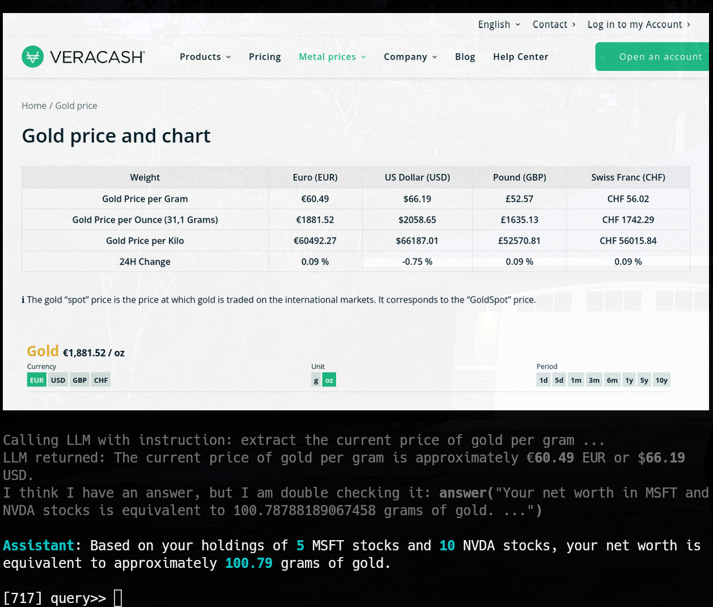
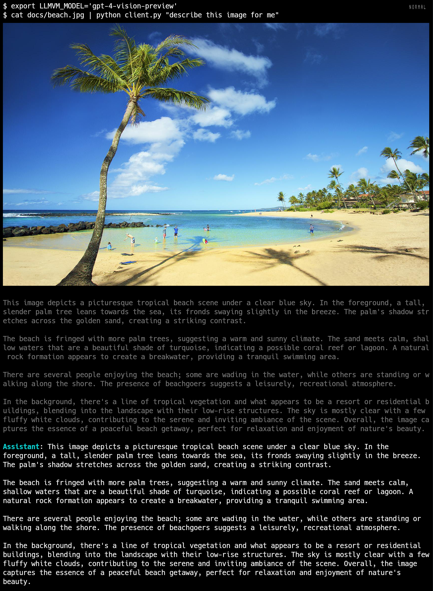
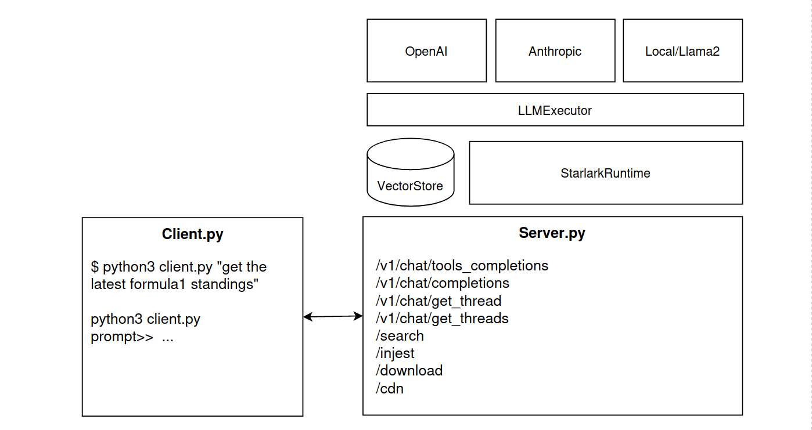

# LLMVM

LLMVM is a CLI based productivity tool that uses Large Language Models and local Python tools/helpers to reason about and execute your tasks. A CLI client (client.py) either connects directly to an LLM provider or will connect to a local server (server.py) that coordinates tool execution, [Retrieval Agumented Generation](https://blogs.nvidia.com/blog/what-is-retrieval-augmented-generation/), document search and more.

It supports [OpenAI](https://openai.com/blog/openai-api) GPT 3.5/4.0/4 Turbo/Vision models from OpenAI, and [Claude 2.1](https://www.anthropic.com/index/claude-2) from [Anthropic](https://anthropic.com). [Gemini](https://deepmind.google/technologies/gemini/) and [Mistral](https://deepmind.google/technologies/gemini/) are currently experimental. It's best used with the [kitty](https://github.com/kovidgoyal/kitty) terminal as LLMVM will screenshot and render images and work directly with GPT 4.5 vision models.

LLMVM's features are best explored through examples:

#### Tool Use: Controlling Firefox Browser

```$ pip install llmvm-cli```

```$ python -m llmvm.server.server```

```$ python -m llmvm.client.client```

```bash
query>> Go to the https://ten13.vc/team website and extract the list of names
```


The LLMVM server is coordinating with the LLM to deconstruct the query into executable code calls various Python helpers that can be executed in the server process on behalf of the LLM. In this case, the server is using a headless Firefox instance to download the website url, screenshot and send progress back to the client, convert the website to Markdown, and hand the markdown to the LLM for name extraction. More on how this works later.

#### Tool Use: Finance and Searching

```bash
query>> I have 5 MSFT stocks and 10 NVDA stocks, what is my net worth in grams of gold?
```


...



Here we're calling Yahoo Finance to get the latest prices of Microsoft and NVidia. We're also using Google Search functionality to find the latest price of gold.

#### Tool Use: PDF Parsing and Understanding

```bash
query>> -p docs/turnbull-speech.pdf "what Malcolm Turnbull advocating for?"
```


LLMVM will parse and extract PDF's (including using OCR if the PDF doesn't extract text properly) and supply the LLM with the text as content for queries.

#### As a Command Line Utility

I bash/fish alias llm:

```alias llm=LLMVM_EXECUTOR="openai" LLMVM_MODEL="gpt-4-vision" LLMVM_PROFILING="true" python llmvm.client.client```

and then:

```bash
cat somecode.py | llm -o direct "rewrite this code; make it cleaner and easier to read"
```

Image understanding is supported via OpenAI's GPT 4.5 vision model:

```bash
cat docs/beach.jpg | llm "describe this image for me"
```



```bash
llm "generate cat names" > cat_names.txt
```

```bash
llm -p meeting_notes.txt "correct spelling mistakes and extract action items"
```

And some really nice Unix pipe foo:

```bash
llm "download the latest news about Elon Musk as bullet points" | \
llm "write a small blog post from the bullet points in the previous message" | \
llm "create a nice html file to display the content" > output.html
```

#### As a Client REPL


It integrates well with [vim](https://neovim.io/) or your favorite editor to build multiline queries, or edit long message threads.

You can even Ctrl-y + p to paste images into the Repl for upload and parsing by OpenAI's vision models.

## Install

You'll need either an OpenAI API account (including access to the GPT 4.x API) or an Anthropic API account. It's highly recommended to sign up for a free [SerpAPI](https://serpapi.com/) account to ensure that searches work. A [sec-api.io](https://sec-api.io) is optional to get public company 10K or 10Q filings.

Ensure you have the following environment variables set:

```bash
OPENAPI_API_KEY     # your Openai API key, or ...
ANTHROPIC_API_KEY   # your Anthropic API key
GOOGLE_API_KEY      # your Gemini API key
MISTRAL_API_KEY     # your Mistral API key
EDITOR              # set this to your favorite terminal editor (vim or emacs or whatever) so you can /edit messages or /edit_ast the Starlark code before it gets executed etc.
```

These are optional:

```bash
SERPAPI_API_KEY     # https://serpapi.com/ API key for web and news searches.
SEC_API_KEY         # if you want to use SEC's Edgar api to get 10K's and 10Q's etc, get an account at https://sec-api.io/
```

#### Manual Installation

If you don't want to do ```pip install llmvm-cli``` you can do:

* Install [pyenv](https://github.com/pyenv/pyenv):
  * ```curl https://pyenv.run | bash```
* Install Python 3.11.6 using pyenv and set a virtualenv:
  * ```pyenv install 3.11.7```
  * ```pyenv virtualenv 3.11.7 llmvm```
  * ```pyenv local llmvm```
* Install [poetry](https://python-poetry.org/):
  * ```curl -sSL https://install.python-poetry.org | python3 -```
  * ```poetry config virtualenvs.prefer-active-python true```
* Install library dependencies:
  * ```poetry install```
* Install [Playwright](https://playwright.dev/python/) Firefox automation:
  * ```playwright install firefox```
* Install [Poppler](https://poppler.freedesktop.org/)
  * ```sudo apt install poppler-utils```
  * ```brew install poppler```
* Edit and save config.yaml into the config directory
  * ```cp llmvm/config.yaml ~/.config/llmvm/config.yaml```

 Run the llmvm server and client:
  * ```python -m llmvm.server.server```
  * ```python -m llmvm.client.client```

[Optional]

* Install [viu](https://github.com/atanunq/viu) for image rendering in macos/linux terminals ```cargo install viu```
* (the kitty terminal renders images out of the box)

#### Docker instructions:

* run `docker.sh -g` (builds the image, deploys into a container and runs the container)
* python -m llmvm.server.server will automatically run on container port 8011. The host will open 8011 and forward to container port 8011.
* Use docker desktop to have a look at the running server logs; or you can ssh into the container, kill the server process, and restart from your own shell.

With the docker container running, you can run client.py on your local machine:

* export LLMVM_ENDPOINT="http://localhost:8011"
* python -m llmvm.client.client

You can ssh into the docker container: ssh llmvm@127.0.0.1 -p 2222

#### Configuring Anthropic vs. OpenAI

* open `~/.config/llmvm/config.yaml` and change executor to 'anthropic' or 'openai':

```yaml
executor: 'anthropic'  # or 'openai'
```

or, you can set environment variables that specify the execution backend and the model you'd like to use:

```bash
export LLMVM_EXECUTOR='openai'
export LLMVM_MODEL='gpt-4-vision-preview'
python -m llmvm.client.client "hello, who are you?"
```

#### Performance Profiling

* open `~/.config/llmvm/config.yaml` and change profiling to 'true' or 'false'.

If the LLMVM server is running, profiling output will be emitted there, and if the server is not running, the LLMVM client will emit profiling information to the debug stream:

```bash
export LLMVM_PROFILING="true"
...
DEBUG    total_time: 8.42 prompt_time: 0.55 sample_time: 7.87
DEBUG    prompt_len: 28 sample_len: 194
DEBUG    p_tok_sec 50.52 s_tok_sec: 23.15
```

## Architecture



#### You can:

* Write arbitrary natural language queries that get translated into Starlark code and cooperatively executed
* Upload .pdf, .txt, .csv and .html and have them ingested by FAISS and searchable by the LLMVM.
* Add arbitrary Python helpers by modifying ~/.config/llmvm/config.yaml and adding your Python based helpers. Note: you may need to hook the helper in [starlark_runtime.py](https://github.com/9600dev/llmvm/blob/master/prompts/starlark/starlark_tool_execution.prompt). You may also need to show examples of its use in [prompts/starlark/starlark_tool_execution.prompt](https://github.com/9600dev/llmvm/blob/master/prompts/starlark/starlark_tool_execution.prompt)
* [server.py](https://github.com/9600dev/llmvm/blob/master/server.py) via /v1/chat/completions endpoint, mimics and forwards to OpenAI's /v1/chat/completions API.
* Use [client.py](https://github.com/9600dev/llmvm/blob/master/client.py) without running the server. Tools no longer work, but most other things do.
* TODO: build real time streaming, so you can wire up pipelines of llmvm execution to arbitrary streams of incoming data.
* TODO: search is weak. Make it better.
* TODO: all the threading and asyncio stuff is not great. Fix it. Might use RxPy.
* TODO: local llama can work, but doesn't work well.
* TODO: anthropic support [done]

## Advanced Architectural Details

#### Error Correction

Each step of statement execution is carefully evaluated. Calls to user defined helper functions may throw exceptions, and code may be semantically incorrect (i.e. bindings may be incorrect, leading to the wrong data being returned etc). LLMVM has the ability to back-track up the statement execution list (todo: transactional rollback of variable assignment is probably the right call here but hasn't been implemented yet) and work with the LLM to re-write code, either partially or fully, to try and achieve the desired outcome.

The code that performs error correction starts [here](https://github.com/9600dev/llmvm/blob/01816aeb7107c5a747ee62ac3475b5037d3a83d7/starlark_runtime.py#L219), but there's still a bit more work to do here, including having the LLM engage in a "pdb" style debugging session, where locals in the Python runtime can be inspected for code-rewriting decisions.

#### Helpers

You can define any arbitrary helper, and add it to the Starlark Runtime in ```StarlarkRuntime.setup()```. It'll automatically generate the helper tool's one-shot prompt example for the LLM, and will appear in the LLM responses for Starlark generated code. The LLMVM runtime will sort out the binding and marshalling of arguments via llm_bind().

Here are the list of helpers written so far:

```python
WebHelpers.search_linkedin_profile(first_name, last_name, company_name)  # Searches for the LinkedIn profile of a given person name and optional company name and returns the profile text
WebHelpers.get_linkedin_profile(linkedin_url)  # Extracts the career information from a person's LinkedIn profile from a given LinkedIn url
EdgarHelpers.get_latest_form_text(symbol, form_type)  # This is useful to get the latest financial information for a company,
their current strategy, investments and risks.
PdfHelpers.parse_pdf(url_or_file)  # You can only use either a url or a path to a pdf file.
MarketHelpers.get_stock_price(symbol)  # Get the current or latest price of the specified stock symbol
MarketHelpers.get_market_capitalization(symbol)  # Get the current market capitalization of the specified stock symbol
```

Downloading web content (html, PDF's etc), and searching the web is done through special functions: ```download()``` and ```search()``` which are defined in the LLMVM runtimes base class libraries. ```download()``` as mentioned uses Firefox via Microsoft Playwright so that we can avoid web server blocking issues that tend to occur with requests.get(). ```search()``` uses [SerpAPI](https://serpapi.com/), which may require a paid subscription.


#### Walkthrough of tool binding and execution

For our first example:

```bash
query>> go to https://ten13.vc/team and extract all the names
```

Let's walk through each line of the generated Starlark:

##### ```var1 = download("https://ten13.vc/team")```

The [download()](https://github.com/9600dev/llmvm/blob/01816aeb7107c5a747ee62ac3475b5037d3a83d7/starlark_runtime.py#L392C12-L392C12) function is part of a set of user definable base class libraries that the LLM knows about: download() llm_call() llm_loop_bind(), llm_bind(), answer() and so on. download() fires up an instance of Firefox via [Playwright](https://playwright.dev/) to download web or PDF content and convert them to Markdown.

##### ```var2 = llm_call([var1], "extract list of names")  # Step 2: Extract the list of names```

[llm_call(expression_list, instruction) -> str](https://github.com/9600dev/llmvm/blob/f0caa7268822ec517af4a8b9c3afff6b086008e8/starlark_runtime.py#L427) takes an expression list, packages those expressions up into a stack of LLM User messages, and passes them back to the LLM to perform the instruction. If the stack of Messages is too big to fit in the context window, [faiss](https://github.com/facebookresearch/faiss) is used to chunk and rank message content via the following pseudocode:

  * Chunk content via tiktoken, 256 token chunks.
  * Take the original query "Go to the https://ten13.vc/team website ..." and the instruction query "extract list of names" and vector search and rank on message content.
  * Take a random sample of chunks, ask the LLM to decide if **all** content is required to achieve success in the task.
    * If "YES", Map-Reduce the task over all Message chunks.
    * If "NO", fit top (n) chunks sized to context window and perform instruction.
  * Return instruction result.

The map-reduce is done per-message, allowing for multiple expressions to be chunked and ranked independently, which is useful for queries like "download document 1, and document 2 and compare and contrast".

##### ```for list_item in llm_loop_bind(var2, "list of names"):  # Step 3: Loop over the list of names```

[llm_loop_bind(expression, instruction) -> List](https://github.com/9600dev/llmvm/blob/f0caa7268822ec517af4a8b9c3afff6b086008e8/starlark_runtime.py#L444) takes an arbitrary expression, converts it to a string, then has an LLM translate that string into a Starlark list ["one", "two", "three", ...].

In this particular case, ```var2``` has the following string, the response from GPT:

> Based on the provided data, here is a list of names:
>
> 1. Steve Baxter
> 2. Stew Glynn
> 3. An Vo
> 4. Alexander Cohen
> 5. Margot McQueen
> 6. Sophie Robertson
> 7. Mel Harrison
> 8. Elise Cannell
> 9. Seamus Crawford
> 10. Alexander Barrat

And ```llm_loop_bind()``` takes this arbitrary text and converts it to: ["Steve Baxter", "Stew Glynn", "An Vo", "Alexander Cohen", "Margot McQueen", "Sophie Robertson", "Mel Harrison", "Elise Cannell", "Seamus Crawford", "Alexander Barrat"]

##### ```var3 = llm_bind(list_item, "WebHelpers.search_linkedin_profile(first_name, last_name, company_name)")```

[llm_bind(expression, function_definition_str) -> Callable](https://github.com/9600dev/llmvm/blob/01816aeb7107c5a747ee62ac3475b5037d3a83d7/bcl.py#L276) is one of the more interesting functions. It takes an expression and a string based function definition and tries to bind arbitrary data to the function arguments (turning the definition into a callsite). It performs these steps:

* For these scopes [expression, original query, dictionary of currently in scope locals()] ask the LLM to bind the arguments (in this case: first_name, last_name, company_name).
* If the LLM can't bind any of the arguments, specify "None", then add a comment string "#" to the end of the callsite with a natural language question that, if answered, would allow the callsite to be bound. e.g:
  * WebHelpers.search_linkedin_profile("Steve", "Baxter", None)  # Which company does Steve Baxter work for?
* Move up a scope, and include the original binding ask, plus the LLM generated question, which combined greatly improves the odds of argument binding.
  * (in this particular case, the company Steve Baxter works for is defined in the original webpage download() string, and when the LLM is passed the locals() dictionary, is able to self-answer the question of "which company Steve Baxter works for" and thus bind the callsite properly).
  * -> WebHelpers.search_linkedin_profile("Steve", "Baxter", "Transition Level Investments")

##### ```answer(answers)  # Step 7: Show the summaries of the LinkedIn profiles to the user```

[answer()](https://github.com/9600dev/llmvm/blob/f0caa7268822ec517af4a8b9c3afff6b086008e8/starlark_runtime.py#L477) is a collection of possible answers that either partially solve, or fully solve for the original query. Once code is finished executing, each answer found in answers() is handed to the LLM for guidance on how effective it is at solving/answering the query. The result is then shown to the user, and in this case, it's a career summary of each of the individuals from [TEN13](https://ten13.vc) extracted from LinkedIn.

#### Debugging Firefox Automation Issues

The Starlark runtime uses [Playwright](https://playwright.dev/python/) to automate Firefox on its behalf. By default, it runs Firefox in headless mode, but this can be changed in `~/.config/llmvm/config.yaml`:

```yaml
firefox_headless: true
```

You can also copy your own browsers cookies file into Playwright's Firefox automation instance. This allows the Playwright instance to assume your logged in sessions to things like LinkedIn. Simply:

* run ```scripts/extract_cookies.sh > cookies.txt```
* move the cookies.txt file to a secure location
* update ```config.yaml``` to point to the cookies file:

```yaml
firefox_cookies: '~/.local/share/llmvm/cookies.txt'
```

#### The Problem this prototype solves

ChatGPT supports 'function calling' by passing a query (e.g. "What's the weather in Boston") and a JSON blob with the signatures of supporting functions available to be called locally (i.e. def get_weather(location: str)...). Examples seen [here](https://medium.com/@lucgagan/understanding-chatgpt-functions-and-how-to-use-them-6643a7d3c01a).

However, this interaction is usually User Task -> LLM decides what helper function to call -> local host calls helper function -> work with result, and does not allow for arbitrary deconstruction of a task into a series of helper function calls that can be intermixed with both control flow, or cooperative sub-task execution.

This prototype shows that LLM's are capable of taking a user task, reasoning about how to deconstruct the task into sub-tasks, understanding how to program, schedule and execute those sub-tasks on its own or via a virtual machine, and working with the VM to resolve error cases. We ask the LLM to use [Starlark](https://github.com/bazelbuild/starlark) expressed as [A-normal form](https://en.wikipedia.org/wiki/A-normal_form) as the programming language, and execute Starlark statement-by-statement on a local Python interpreter. When errors arise (syntax errors, exceptions, or semantic problems), we pause execution and work with the LLM to understand and resolve the error by exposing the locals dictionary, and allowing the LLM to "debug" the current execution state.

## Other cute stuff

You can use the ```act``` command, which will search [awesome prompts](https://github.com/f/awesome-chatgpt-prompts) and set the System Prompt to "act" like the awesome prompt you select.

A fun one is graphing "narrative extraction", which is useful for quickly summarizing news articles:

Download two news articles and put them in the "Messages" stack:

```bash
url https://www.cnn.com/2023/08/27/football/what-happened-luis-rubiales-kiss-intl/index.html
url https://www.bbc.com/sport/football/66645618
```

```bash
act graph
```

```bash
"extract the narrative from the documents I sent you in the first two messages"
```

Gives us a GraphVis visualization (cut off to fit screen):


And related narrative extraction + code:


## Things to do

* Error handling still needs a lot of work.
* Working on Source Code insights (mode 'code'). You'll be able to hand it a project directory and work with the LLM to understand what the code is doing. Check out [source.py](https://github.com/9600dev/llmvm/blob/master/source.py)
* ChatGPT and Claude doesn't conform to system prompts specifying how to shape the output of the response. Saying things like "Only reply with Starlark code" and "don't apologize" tends to work randomly, or not at all. Need to fix this.
* Integration with local LLM's via [llama.cpp](https://github.com/ggerganov/llama.cpp) etc. [started]
* More complicated natural language queries tends to make the LLM generate unwieldy code. Need statement by statement execution, passing the LLM the already executed code, asking it if it wishes to re-write the later part of the code (sort of like continuation passing style execution).
* Playwright integration with LLM -- it should be straight forward to have cooperative execution for the task of proceeding through web app flows (login, do stuff, extract info, logout).
* Fix bugs and refactor. The code is pretty hacky.
* Write some docs.